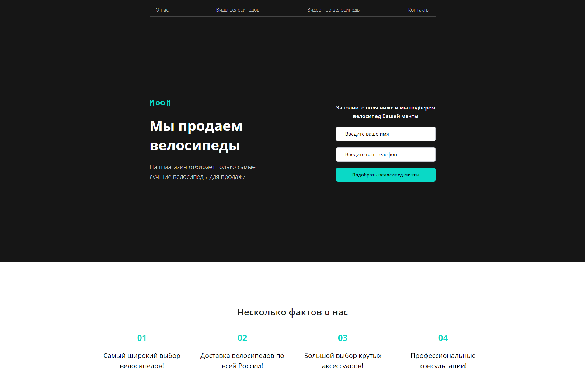

# Bicycles: accelerator level 1

### 📋 Проект акселератора #1: Landing Page (Старт 05.03.2021 - Дедлайн 15.03.2021)
🔗 URL: <a href="https://bicycles-ebon.vercel.app/" target="_blank">bicycles-ebon.vercel.app</a>
### 
### 

* Менеджер: [Софья Дышпан].
* Тестировщик: [Евгения Рябикова].
* Наставник: [Виктор Гирда].
* Исполнитель: [Антон Решетников].

<br clear="both">

<div>
  
</div>

### 🛠 Технологии:
- Pug
- Sass
- Java Script (ECMAScript 6)
- Gulp, Webpack

### 💡 Описание:
Учебный проект, в рамках которого оттачил практические навыки, полученные во время учебы. Так же данный проект являеться первым шагом в грейдировании, перед оплачиваемой стажировкой в аутсорс компании ООО "Ракета" (Лига А).<br>
Основной функционал включает:
- Адаптивная, валидная верстка.
- Якорные ссылки и скрол по клику к ним.
- Форма обратной связи. Валидация формы.
- Различные блоки.
- Бургер (мобильное) меню.

### Основные команды для работы:

- Установка 
```
npm i
```

- Запуск локального сервера без минификаций
```
npm start
```

- Сборка проекта, минификация скриптов <br>
и оптимизация изображений перед деплоем на прод
```
npm run build
```

- Запуск тестирования на соответствия кодгайдам
```
npm test
```

### Вся разработка ведётся в директории `source`
### Итоговый код попадает в директорию `build`

